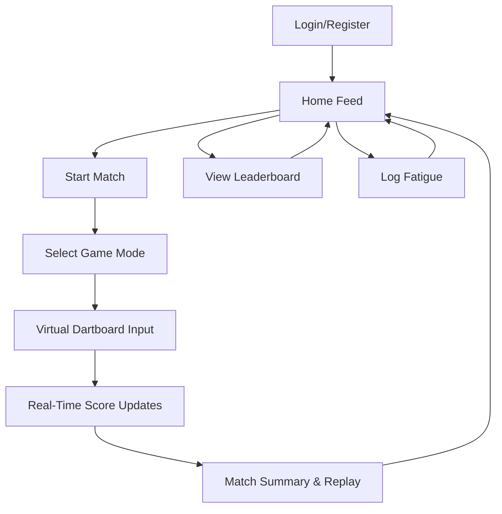

# Dart Performance Tracker - Product Requirements Document (Extended)

**Version:** 1.0 (MVP)  
**Date:** 2025-08-31  
**Prepared by:** Gauthier Hubert  

---

## 1. Overview

The Dart Performance Tracker is a **web-based platform** for **amateur league players** and **professional dart players** to track, analyze, and improve their performance in real-time.

The MVP provides:
- **Turn-by-turn live scoring**
- **Comprehensive performance analytics**
- **Practice mode with custom drills**
- **Fatigue tracking**
- **Leaderboards & club management**
- **Strava-inspired social feed**

Future phases will expand into **mobile apps**, **wearables**, **achievements**, and **media uploads**.

---

## 2. Goals

- Make performance tracking **intuitive, fast, and visually engaging**.
- Allow users to **track both solo and competitive play**.
- Enable clubs and leagues to manage members, matches, and leaderboards.
- Provide **real-time** stats and social sharing to build community engagement.

---

## 3. Target Audience

**Primary:**  
- Amateur league dart players  
- Professional dart players  

**Secondary:**  
- Clubs, leagues, coaches  
- Competitive pub players  

---

## 4. MVP Feature Scope

### 4.1 User Accounts
- **Email/password authentication** (Appwrite Auth).
- Profile:
  - Name
  - Avatar
  - Club/league affiliation
  - Country
  - Stats summary

---

### 4.2 Match Tracking
- Supported formats: **501, 301, Cricket, Around the Clock**.
- Input via **virtual dartboard UI**.
- Turn-by-turn live scoring:
  - Current score
  - Throw history
  - Checkout attempts/successes
- Metrics:
  - Avg score/turn
  - Checkout %
  - Doubles %
  - 180s count
  - Highest checkout
  - Heatmap
  - Throw timestamps
- Match replay with complete throw history.
- Match location logging.
- Club/league match management.
- Real-time updates for spectators.

---

### 4.3 Practice Mode
- Separate from match mode.
- Custom drills:
  - Target numbers
  - Doubles practice
  - Checkout practice
  - Free play
- Same metrics as match mode.

---

### 4.4 Fatigue Tracking
- Manual input:
  - Sleep quality (1–5)
  - Stress level
  - Alcohol (yes/no)
  - RPE (Rate of Perceived Exertion)
- Daily fatigue score calculated.
- Correlation overlay on performance charts.

---

### 4.5 Social & Competitive
- Leaderboards:
  - Global
  - Club/league
  - Friends-only
- Social feed:
  - Own matches
  - Friends’ matches
  - Match detail pages
- Share matches to social media.

---

### 4.6 UI/UX
- Strava-like interface.
- Dark/light mode toggle.
- Location tagging.

---

## 5. Post-MVP Features
- Achievements/badges
- Media uploads
- Export stats
- iOS → Android apps
- Wearables integration
- Coaching tips
- Match video integration

---

## 6. Detailed User Stories

### Authentication
- **As a player**, I want to register with my email and password so I can save my matches.
- **As a player**, I want to log in so I can access my profile and history.

### Match Tracking
- **As a player**, I want to start a new match selecting the game format so the scoring rules match the format.
- **As a player**, I want to click on a virtual dartboard to log hits so scoring is fast.
- **As a spectator**, I want to follow a match in real-time so I can see scores update.

### Practice Mode
- **As a player**, I want to choose drills so I can focus on weak areas.
- **As a player**, I want to see my accuracy per target zone.

### Fatigue Tracking
- **As a player**, I want to log my fatigue factors so I can correlate them with performance.

### Leaderboards
- **As a player**, I want to see my ranking globally, in my club, and among friends.

### Social Feed
- **As a player**, I want to view recent matches in a timeline.
- **As a player**, I want to open a match detail to see stats and comments.

---

## 7. User Flow Diagrams

---

## 8. Wireframe Descriptions

### Home Feed
- Top bar: logo, search, profile menu.
- Feed cards: match summary, player, score, format, location, date.
- Floating “+” button for new match/practice.

### Match View
- Scoreboard at top.
- Virtual dartboard centered.
- Turn history below.
- Metrics sidebar (checkout %, avg score).

### Leaderboard
- Tabs: Global, Club, Friends.
- Table view: rank, player, matches played, avg score.

### Practice Mode
- Drill selector.
- Virtual dartboard.
- Accuracy heatmap.

---

## 9. Extended Data Model

### Enums
- **GameFormat**: "501", "301", "Cricket", "Around the Clock"
- **DrillType**: "Target", "Doubles", "Checkout", "FreePlay"
- **Role**: "Player", "Spectator"
- **FatigueScale**: 1–5

---

## 10. API Endpoints (Appwrite Functions)

**POST /matches**
- Input: players[], game_format, location
- Output: match_id

**POST /matches/{id}/throws**
- Input: player_id, hit_segment, score
- Output: updated match state

**GET /matches/{id}**
- Output: match details + throw history

**POST /fatigue**
- Input: user_id, sleep, stress, alcohol, rpe
- Output: fatigue_score

---

## 11. Non-Functional Requirements
- **Performance**: match updates in <500ms.
- **Scalability**: handle 1,000 concurrent matches.
- **Security**: JWT-based auth, SSL enforced.
- **Availability**: 99.9% uptime target.
- **PWA Support**: offline caching for score logging.

---

## 12. Roadmap

**Phase 1 (MVP)** – 3–4 months  
- Core features, responsive web app, closed beta.

**Phase 2** – +3–6 months  
- Achievements, media uploads, iOS.

**Phase 3** – +6–12 months  
- Android, wearables, advanced coaching.

---
